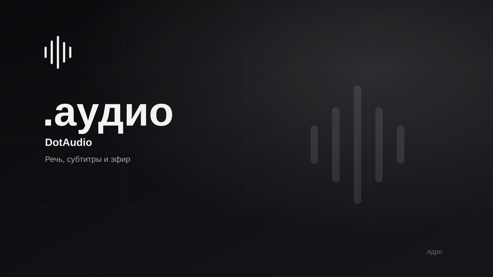

# .аудио / DotAudio

<p>
  
  
  
  <!-- loc:start --><!-- loc:end -->
</p>



Desktop-приложение к статье о Whisper для Windows. Оно распознаёт русскую речь
локально через faster-whisper, показывает живые субтитры, помогает с диктовкой
и превращает аудио или видео в редактируемую расшифровку и караоке-субтитры.

## Запуск

Нужен **Python 3.12 или 3.13**. Откройте PowerShell в папке проекта и выполните:

```powershell
cd C:\Users\User\PycharmProjects\DotAudio

# Только при первом запуске
py -3.12 -m venv .venv
.\.venv\Scripts\python.exe -m pip install -e ".[dev,server]"

# Запуск приложения из исходников, без .exe
$env:PYTHONPATH = "src"
.\.venv\Scripts\python.exe -m dotaudio
```

Если окружение уже создано и зависимости установлены, нужны только последние
dве строки. Альтернатива после `pip install -e`:

```powershell
.\.venv\Scripts\dotaudio.exe
```

При первом распознавании выбранная модель Whisper загрузится в локальный кеш.
Для быстрой проверки выберите `tiny` в разделе «Модели». Для MP4-экспорта с
караоке-субтитрами требуется установленный `ffmpeg` в `PATH`.

## Что внутри

- Переносимый мини-остров: уровень сигнала, статус записи, раскрытие в
  рабочее окно и переназначаемые горячие клавиши.
- Live-субтитры - главный режим: отдельное always-on-top окно, предварительный
  текст по коротким снимкам речи и финализация фраз в истории. Русский язык
  выбран по умолчанию; режим Whisper Translate создаёт английские субтитры.
- Диктовка с копированием текста в буфер обмена, безопасной вставкой в
  сохранённое целевое окно и сохранением исходной расшифровки в историю.
- Локальный словарь терминов, исправлений и voice snippets для финального
  текста диктовки без передачи правил на сервер.
- Выбор и проверка устройств ввода и вывода, визуальный уровень сигнала.
- Медиа-режим: аудио или видео, сегменты с таймкодами, ручное редактирование,
  undo/redo и экспорт TXT, SRT, VTT и JSON. SRT/VTT перегруппировываются по
  словным таймкодам, длине и пунктуации без выдумывания времени.
- Караоке-просмотр с подсветкой текущего слова, экспорт ASS и MP4 поверх видео
  или выбранной обложки.
- Мониторинг до четырёх прямых HTTP(S) источников, локальные ключевые фразы и
  автоматическое переподключение потока с backoff.
- Локальная SQLite-история с миграциями и восстановлением прерванных сессий,
  журнал работы, модели `tiny`, `base`, `small`,
  `medium` и `large-v3`, профили скорости и качества.

## Компоненты

```text
src/dotaudio/
  app.py, controller.py, desktop.py   # запуск, связка QML и системное окно
  capture.py -> pipeline.py -> engine.py
                                      # захват, очередь и faster-whisper
  storage.py, transcripts.py          # SQLite, миграции и экспорт расшифровок
  karaoke.py                          # word timestamps, ASS и MP4
  qml/MainMvp.qml                     # оболочка: остров, сцена субтитров, окно
  qml/MiniIsland.qml, LiveTheater.qml, CaptionOverlay.qml
                                      # фазы острова, Live-сцена и экран зала
  qml/Theme.js, Icon.qml, Waveform.qml, CaptionText.qml
  qml/KaraokePreview.qml, TranscriptEditor.qml
tests/                                # pytest, без микрофона и без скачивания моделей
docs/                                 # продукт, архитектура, исследование
```

Распознавание и запись выполняются вне GUI-потока. Черновой Live-текст хранится
только в памяти, а SQLite получает подтверждённые сегменты. В live-режиме не
запрашиваются word timestamps, чтобы уменьшить задержку. В медиа-режиме они
сохраняются для караоке и точной правки таймкодов.

## Команды

```powershell
$env:PYTHONPATH = "src"
.\.venv\Scripts\python.exe -m pytest -q
.\.venv\Scripts\ruff.exe check src tests

# Проверить загрузку QML без доступа к микрофону
$env:QT_QPA_PLATFORM = "offscreen"
.\.venv\Scripts\python.exe -m dotaudio --smoke-test --data-dir .local-check
```

Последняя проверка: 76 passed, `ruff check src tests` без ошибок, QML smoke-test
завершается успешно. В тестах остаются два предупреждения совместимости FastAPI
и Starlette с TestClient. Реальные микрофон, системный звук, GPU и FFmpeg зависят
от конкретного компьютера Windows и проверяются на нём вручную.

## Стек

<p>
  
  
  
  
  
  
  
</p>

## Документы

- [Описание продукта](docs/PRODUCT.md)
- [Архитектура](docs/ARCHITECTURE.md)
- [Исследование решений](docs/RESEARCH.md)
- [Передача проекта](docs/HANDOFF.md)

## Архитектура

```text
микрофон / WASAPI loopback
  -> capture.py, блоки 100 мс
  -> pipeline.py, endpointing + preview + final очередь
  -> engine.py, faster-whisper / CTranslate2
  -> controller.py, Qt signals
  -> CaptionOverlay.qml / LiveTheater.qml / SQLite history
```

- QML не запускает inference и не обращается к SQLite.
- Модель готовится до старта захвата Live, тяжёлая работа не выполняется в GUI-потоке.
- Предварительные задачи заменяются свежими, финальные сегменты сохраняются один раз.
- Перегрузка очереди видна пользователю, а не превращается в бесконечную задержку.

## Лицензия

© 2026 DotCore. Все права защищены.

Проприетарный код. Использование, копирование, изменение и распространение запрещены без письменного разрешения автора. Исходный код открыт только для ознакомления. См. [LICENSE](LICENSE).
